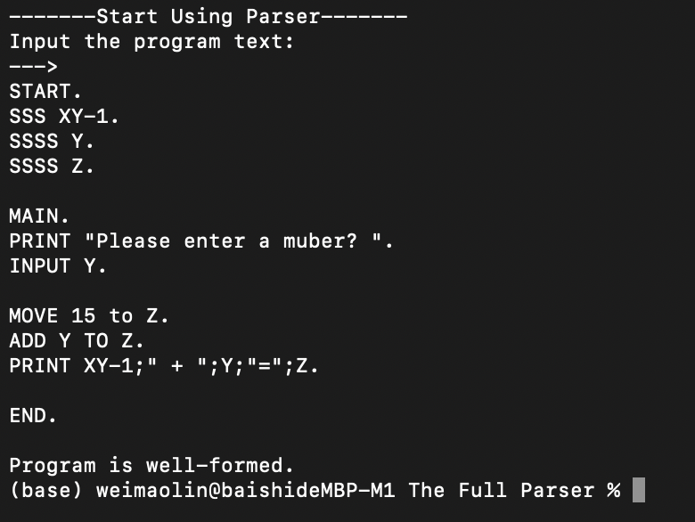
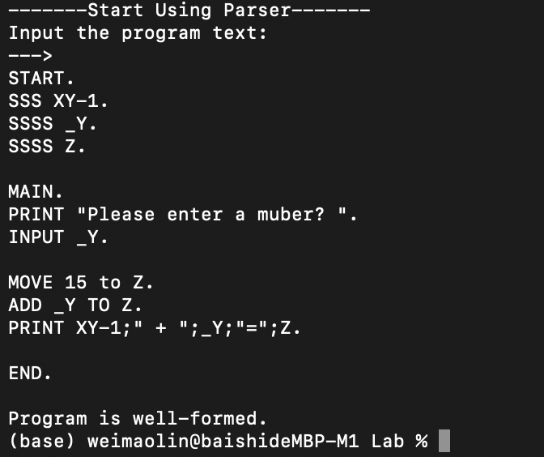

# You can follow the steps to run this parser code:
```
flex lexer.l
bison -d parser.y
gcc lex.yy.c parser.tab.c
./a.out
```

And you can use following test example to test the code, after the above steps.

This is the first valid example, and if you can not type it right, there will give you the feedback.

```
START.
SSS XY-1.
SSSS Y.
SSSS Z.

MAIN.
PRINT "Please enter a muber? ".
INPUT Y.

MOVE 15 to Z.
ADD Y TO Z.
PRINT XY-1;" + ";Y;"=";Z.

END.
```
There is the screenshot of result.



This is the second valid example, and if you type wrong, there will feedback to you.
```
START.
SSS XY-1.
SSSS _Y.
SSSS Z.

MAIN.
PRINT "Please enter a muber? ".
INPUT _Y.

MOVE 15 to Z.
ADD _Y TO Z.
PRINT XY-1;" + ";_Y;"=";Z.

END.
```
There is the screenshot of results.


